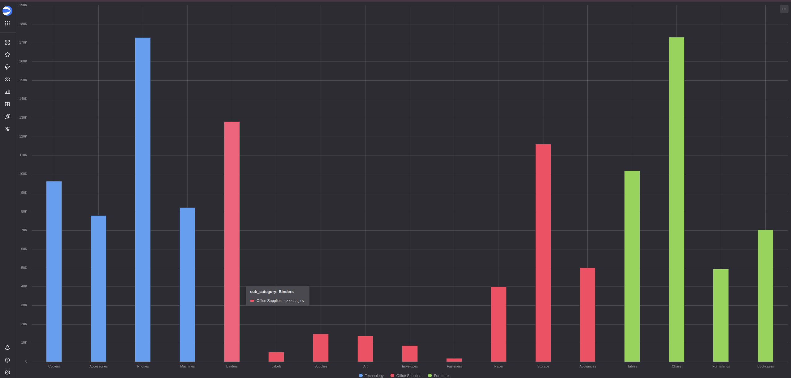

# Data Vault 2.0 для Sample Superstore

Проект хранилища данных на основе методологии Data Vault 2.0 для датасета Sample Superstore, оптимизированный для Greenplum СУБД.

## 📋 Описание проекта

Полная реализация Data Vault 2.0 хранилища данных для анализа розничных продаж. 
За основу взят датасет [Kaggle Superstore](https://www.kaggle.com/datasets/vivek468/superstore-dataset-final). 

Результат визуализирован в [Yandex DataLens](https://datalens.ru/preview/5fwscbmm0dfoq)

[чарт](https://datalens.ru/preview/5fwscbmm0dfoq-sales-superstore-dv)



Проект включает:

- 📐 **Проектирование** - детальная архитектура Data Vault
- 💾 **DDL скрипты** - готовые к развертыванию SQL скрипты для Greenplum
- 📊 **Диаграммы** - визуальное представление структуры
- 📖 **Документация** - полное описание реализации

## 🗂️ Структура проекта

```
.
├── data_vault_design.md          # Документация проектирования хранилища
├── greenplum_ddl.sql              # SQL DDL для создания объектов в Greenplum
├── data_vault_diagram.txt         # ASCII диаграммы архитектуры
├── IMPLEMENTATION_SUMMARY.md      # Сводка реализации и статистика
└── README.md                      # Этот файл
```

## 🏗️ Архитектура Data Vault

### Хабы (Hubs) - Ключевые бизнес-сущности
- **HUB_CUSTOMER** - Клиенты
- **HUB_PRODUCT** - Товары
- **HUB_ORDER** - Заказы

### Связи (Links) - Отношения между сущностями
- **LINK_ORDER_CUSTOMER** - Связь заказов с клиентами
- **LINK_ORDER_PRODUCT** - Позиции заказов (заказы + товары)

### Сателлиты (Satellites) - Описательные атрибуты
- **SAT_CUSTOMER** - Основные атрибуты клиента (имя, сегмент)
- **SAT_CUSTOMER_LOCATION** - Географические атрибуты
- **SAT_PRODUCT** - Атрибуты товара
- **SAT_ORDER** - Атрибуты заказа
- **SAT_ORDER_PRODUCT** - Транзакционные данные (продажи, прибыль)

## 📊 Источник данных

**SampleSuperstore.csv** - транзакционные данные розничных продаж с 21 полем:
- Идентификаторы: Row ID, Order ID, Customer ID, Product ID
- Временные данные: Order Date, Ship Date
- Клиент: Customer Name, Segment, Country, Region, State, City, Postal Code
- Товар: Product Name, Category, Sub-Category
- Транзакции: Sales, Quantity, Discount, Profit, Ship Mode

Подробнее на [Kaggle. About Dataset](https://www.kaggle.com/datasets/vivek468/superstore-dataset-final)

## 🚀 Быстрый старт

### Предварительные требования
- Greenplum yandex-cloud
- Доступ к базе данных с правами CREATE SCHEMA

### Развертывание

1. **Клонировать репозиторий:**
```bash
git clone https://github.com/w3ll1ngt/shiny-adventure-data-vault.git
cd shiny-adventure-data-vault
```

2. **Выполнить DDL скрипт:**
```bash
psql -h <greenplum_host> -U <username> -d <database> -f greenplum_ddl.sql
```

3. **Проверить создание объектов:**
```sql
-- Проверить созданную схему
\dn dv

-- Список таблиц
\dt dv.*

-- Список представлений
\dv dv.*

-- Список функций
\df dv.*
```

## 💡 Примеры использования

### Просмотр актуальных данных о клиентах
```sql
SELECT * FROM dv.v_current_customers
WHERE customer_id = 'Home Office|United States|Great Falls|Montana|59405';
```

### Анализ продаж по категориям
```sql
SELECT 
    category,
    sub_category,
    SUM(sales) as total_sales,
    SUM(profit) as total_profit,
    SUM(quantity) as total_quantity
FROM dv.v_order_details
GROUP BY category, sub_category
ORDER BY total_profit DESC;
```

### Детализация заказа
```sql
SELECT * FROM dv.v_order_details
WHERE order_id = 'Second Class|Henderson|42420'
ORDER BY row_id;
```

### История изменений товара
```sql
SELECT 
    h.product_id,
    s.product_name,
    s.category,
    s.sub_category,
    s.load_date as valid_from,
    COALESCE(s.load_end_date, '9999-12-31'::timestamp) as valid_to
FROM dv.hub_product h
JOIN dv.sat_product s ON h.hub_product_id = s.hub_product_id
WHERE h.product_id = 'FUR-BO-10001798'
ORDER BY s.load_date;
```

## ⚙️ Ключевые особенности

### ✅ Data Vault 2.0 Compliant
- MD5 хеш-ключи с нормализацией
- Бизнес-ключи из исходной системы
- Полная историчность (SCD Type 2)
- Hash diff для обнаружения изменений

### ✅ Оптимизировано для Greenplum
- `DISTRIBUTED BY` на хеш-ключах для MPP
- Индексы на foreign keys для быстрых JOIN
- Частичные индексы для актуальных записей
- Представления без ORDER BY

### ✅ Качество и безопасность
- NULL-safe хеширование (COALESCE)
- Защита от коллизий в композитных ключах
- Уникальные индексы предотвращают дубликаты
- Foreign key constraints для целостности

### ✅ Масштабируемость
- Легкое добавление новых источников
- Независимая загрузка сущностей
- Разделение по частоте изменений
- Поддержка параллельной загрузки

## 📈 Статистика проекта

**Объекты базы данных:**
- 1 схема (dv)
- 2 функции хеширования
- 10 таблиц (3 Hubs + 2 Links + 5 Satellites)
- 15 индексов
- 4 аналитических представления

**Документация:**
- 40+ KB исходной документации
- Детальные диаграммы
- Примеры запросов
- Руководство по ETL

## 📚 Документация

- **[data_vault_design.md](data_vault_design.md)** - Полное описание проектирования хранилища
- **[greenplum_ddl.sql](greenplum_ddl.sql)** - DDL скрипт с комментариями
- **[data_vault_diagram.txt](data_vault_diagram.txt)** - Визуальные диаграммы архитектуры
-  **[diagram drawio](https://app.diagrams.net/#Hw3ll1ngt%2Fshiny-adventure-data-vault%2Fmaster%2Fdv.drawio#%7B%22pageId%22%3A%22QSUUquhp0k-rUladNWHw%22%7D)** - Визуальная диаграмма хранилища в drawio

## 🎯 Преимущества подхода

1. **Гибкость** - легко адаптируется к изменениям бизнес-требований
2. **Аудируемость** - полная история всех изменений данных
3. **Производительность** - оптимизация для Greenplum MPP
4. **Масштабируемость** - поддержка больших объемов данных
5. **Интеграция** - простое добавление новых источников

## 🔧 Технологии

- **СУБД:** Greenplum (совместимо с PostgreSQL)
- **Методология:** Data Vault 2.0
- **Язык:** SQL (DDL, DML)
- **Хеширование:** MD5
- **Архитектура:** MPP (Massively Parallel Processing)

## 📝 Лицензия

Этот проект создан в образовательных целях как часть курса по проектированию хранилищ данных.

## 👤 Автор

[@w3ll1ngt](https://github.com/w3ll1ngt) & GitHub Copilot 

---

**Примечание:** Данный проект демонстрирует правильное применение методологии Data Vault 2.0 для реальных бизнес-данных и оптимизирован для промышленного использования в Greenplum СУБД.